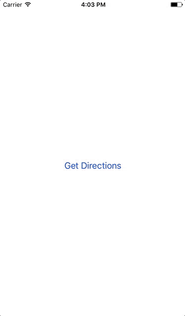

# 🚚 react-native-google-maps-directions 🚲

> 🚕 Get direction using Google Maps in React Native 🚗

[](https://greenkeeper.io/)
[](https://npmjs.org/package/react-native-google-maps-directions)
[](https://npmjs.org/package/react-native-google-maps-directions)
[](https://github.com/feross/standard)
[](https://travis-ci.org/tiaanduplessis/react-native-google-maps-directions)

## Table of Contents

- [About](#about)
- [Install](#install)
- [Usage](#usage)
- [API](#api)
- [Contribute](#Contribute)
- [License](#license)

## About

A tiny module that uses the [React Native Linking API](https://facebook.github.io/react-native/docs/linking.html) to get directions using [Google Maps](https://www.google.com/maps) by opening it in the default browser or app if installed.

## Install

```sh
$ npm install --save react-native-google-maps-directions
```

```sh
$ yarn add react-native-google-maps-directions
```

## Usage

```js
import getDirections from 'react-native-google-maps-directions'

export default class gmapsDirections extends Component {

  handleGetDirections = () => {
    const data = {
       source: {
        latitude: -33.8356372,
        longitude: 18.6947617
      },
      destination: {
        latitude: -33.8600024,
        longitude: 18.697459
      },
      params: [
        {
          key: "travelmode",
          value: "driving"        // may be "walking", "bicycling" or "transit" as well
        },
        {
          key: "dir_action",
          value: "navigate"       // this instantly initializes navigation using the given travel mode
        }
      ]
      waypoints: [
        {
          latitude: -33.8600025,
          longitude: 18.697452,
        },
        {
          latitude: -33.8600026,
          longitude: 18.697453,
        },
           {
          latitude: -33.8600036,
          longitude: 18.697493,
        },
           {
          latitude: -33.8600046,
          longitude: 18.69743,
        },

      ]
    }

    getDirections(data)
  }

  render() {
    return (
      <View style={styles.container}>
        <Button onPress={this.handleGetDirections} title="Get Directions" />
      </View>
    );
  }
}
```

<div align="center">
  
</div>

## API

The module exports a single `getDirections` function that takes a object as its argument. The object may have `destination` (Where you're going to) and `source` (Where you're coming from) both of which have `latitude` and `longitude` number properties. If `source` is undefined, it defaults to the user's current location. If `destination` is undefined, it leaves it blank in Google Maps and the user will be able to enter a destination.

Additionaly parameters can be added as key-value pairs to the params array (optional). The supported parameters are listed [here](https://developers.google.com/maps/documentation/urls/guide#directions-action).

### Waypoints

Waypoints should be passed as an array of objects:

```js
[
        {
          latitude: -33.8600025,
          longitude: 18.697452,
        },
        {
          latitude: -33.8600026,
          longitude: 18.697453,
        },
]
```

## Contribute

Contributions are welcome. Please open up an issue or create PR if you would like to help out.

Note: If editing the README, please conform to the [standard-readme](https://github.com/RichardLitt/standard-readme) specification.

## License

Licensed under the MIT License.
