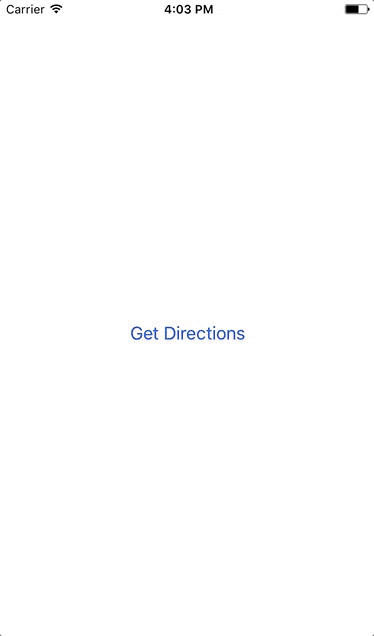

# 🚚 react-native-google-maps-directions 🚲

> 🚕 Get direction using Google Maps in React Native 🚗

[](https://greenkeeper.io/)
[](https://npmjs.org/package/react-native-google-maps-directions)
[](https://npmjs.org/package/react-native-google-maps-directions)
[](https://github.com/feross/standard)
[](https://travis-ci.org/tiaanduplessis/react-native-google-maps-directions)

## Table of Contents

- [About](#about)
- [Install](#install)
- [Usage](#usage)
- [TypeScript](#typescript)
- [API](#api)
- [Troubleshooting](#troubleshooting)
- [Contribute](#Contribute)
- [License](#license)

## About

A tiny module that uses the [React Native Linking API](https://facebook.github.io/react-native/docs/linking.html) to get directions using [Google Maps](https://www.google.com/maps) by opening it in the default browser or app if installed.

## Install

```sh
$ npm install --save react-native-google-maps-directions
```

```sh
$ yarn add react-native-google-maps-directions
```

## Usage

```js
import getDirections from 'react-native-google-maps-directions'

export default class gmapsDirections extends Component {

  handleGetDirections = () => {
    const data = {
       source: {
        latitude: -33.8356372,
        longitude: 18.6947617
      },
      destination: {
        latitude: -33.8600024,
        longitude: 18.697459
      },
      params: [
        {
          key: "travelmode",
          value: "driving"        // may be "walking", "bicycling" or "transit" as well
        },
        {
          key: "dir_action",
          value: "navigate"       // this instantly initializes navigation using the given travel mode
        }
      ],
      waypoints: [
        {
          latitude: -33.8600025,
          longitude: 18.697452
        },
        {
          latitude: -33.8600026,
          longitude: 18.697453
        },
           {
          latitude: -33.8600036,
          longitude: 18.697493
        }
      ]
    }

    getDirections(data)
  }

  render() {
    return (
      <View style={styles.container}>
        <Button onPress={this.handleGetDirections} title="Get Directions" />
      </View>
    );
  }
}
```

<div align="center">
  
</div>

## TypeScript

Type declarations are included with the package; a separate `@types` package is not needed.
Use the same default import as in JavaScript:

```ts
import getDirections from 'react-native-google-maps-directions'
import type { directions } from 'react-native-google-maps-directions'

const options: directions.getDirectionsProps = {
  destination: { latitude: -33.8600024, longitude: 18.697459 }
}

getDirections(options).catch(console.error)
```

The options object and each of its fields are optional. `directions` contains types only;
`getDirections` is the default export, not a named export. The function returns the
promise from React Native's Linking API, including any rejection when the URL cannot be opened.

## API

The module exports a single `getDirections` function that takes a object as its argument. The object may have `destination` (Where you're going to) and `source` (Where you're coming from) both of which have `latitude` and `longitude` number properties. If `source` is undefined, it defaults to the user's current location. If `destination` is undefined, it leaves it blank in Google Maps and the user will be able to enter a destination.

Additionaly parameters can be added as key-value pairs to the params array (optional). The supported parameters are listed [here](https://developers.google.com/maps/documentation/urls/guide#directions-action).

### Waypoints

Waypoints should be passed as an array of objects:

```js
[
        {
          latitude: -33.8600025,
          longitude: 18.697452,
        },
        {
          latitude: -33.8600026,
          longitude: 18.697453,
        }
]
```

## Troubleshooting

### Android: Could not open the url

In the published `2.1.1` package, `getDirections` checks the generated HTTPS Google
Maps URL with `Linking.canOpenURL` before calling `Linking.openURL`. The error
`Could not open the url: ...` means that check returned `false`; it does not prove
that Google Maps is missing.

On Android 11 or later, apps targeting API level 30 or higher are subject to
package visibility filtering. A missing manifest query is one possible reason the
check cannot find a URL handler. See the [React Native Linking guidance](https://reactnative.dev/docs/linking#canopenurl)
and [Android package visibility documentation](https://developer.android.com/training/package-visibility/declaring).

For this package's HTTPS URLs, the query recommended by React Native is:

```xml
<queries>
  <intent>
    <action android:name="android.intent.action.VIEW" />
    <data android:scheme="https" />
  </intent>
</queries>
```

Place this in your app's `android/app/src/main/AndroidManifest.xml`, directly inside
`<manifest>` and outside `<application>`. If `<queries>` already exists, add only
the `<intent>` to it. Rebuild and reinstall the Android app after changing its
manifest; reloading JavaScript does not apply native manifest changes.

This query is limited to HTTPS URL handlers. Do not add `QUERY_ALL_PACKAGES` just
for this package; queries for `geo` or `google.navigation` are not needed for the
HTTPS URLs it generates. A Gradle downgrade is not part of this guidance.

The query does not install a URL handler or guarantee that the URL will open. If
the problem persists, compare `Linking.canOpenURL(url)` and a separate
`Linking.openURL(url)` call using the exact same URL on the same device, and record
each result or error. Direct opening may launch a browser or Maps;
[Android distinguishes querying for an app from starting its activity](https://developer.android.com/training/package-visibility/use-cases#open-urls).
When reporting the issue, include the Android version, React Native and package
versions, `targetSdkVersion`, and those results. This is troubleshooting for the
released `2.1.1` behavior, not a confirmed fix for every launch failure.

## Contribute

Contributions are welcome. Please open up an issue or create PR if you would like to help out.

Run `yarn install --frozen-lockfile --ignore-scripts` and `yarn test` to lint the source,
check the packed npm artifact with strict TypeScript consumers, and exercise URL handling
with a mocked Linking API. These tests do not launch Google Maps or run on a device.

Note: If editing the README, please conform to the [standard-readme](https://github.com/RichardLitt/standard-readme) specification.

## License

Licensed under the MIT License.
